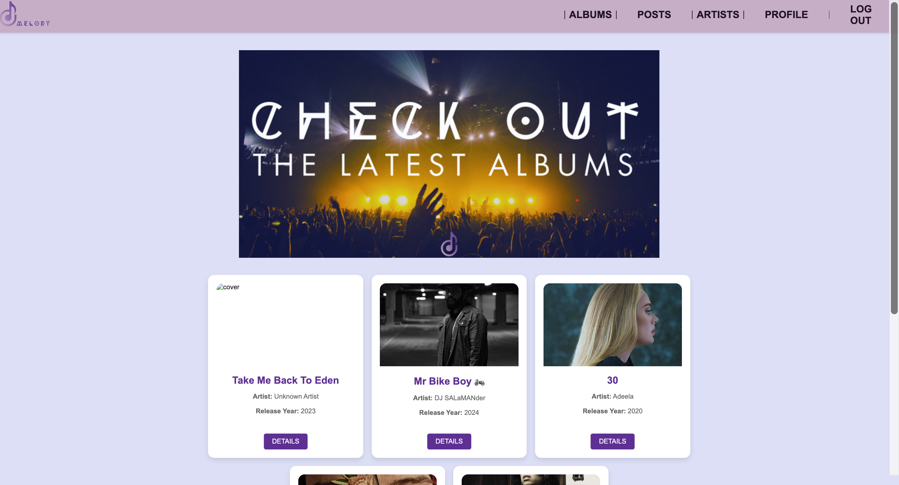
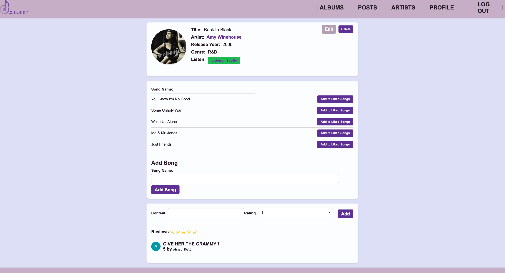
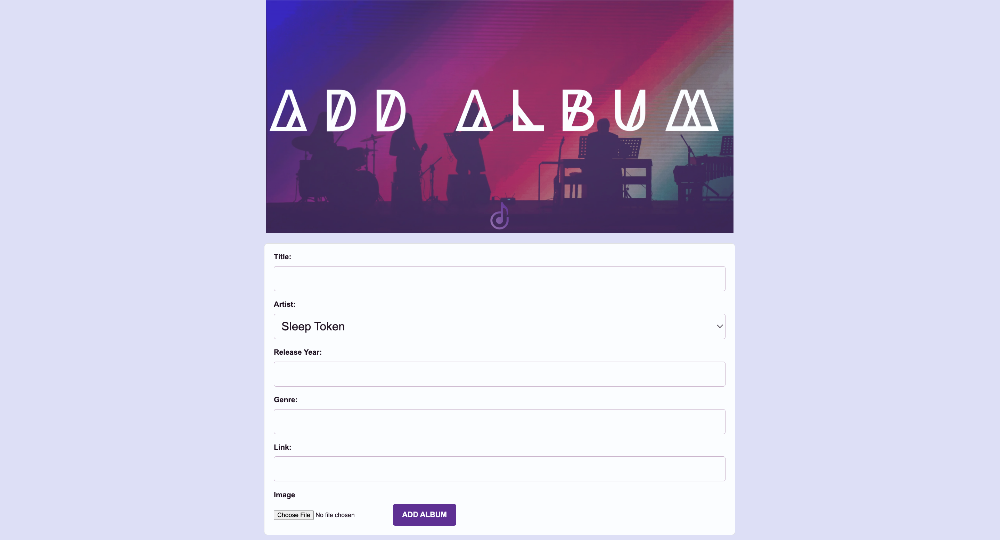
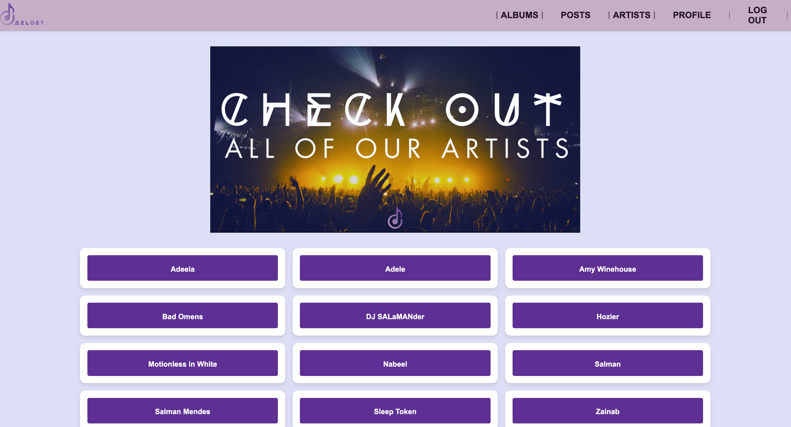
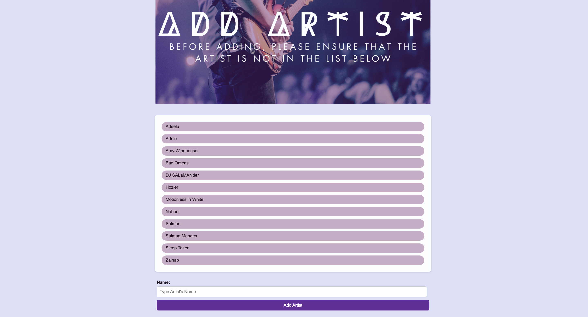
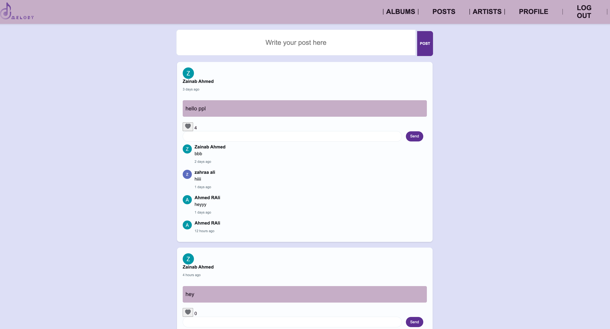
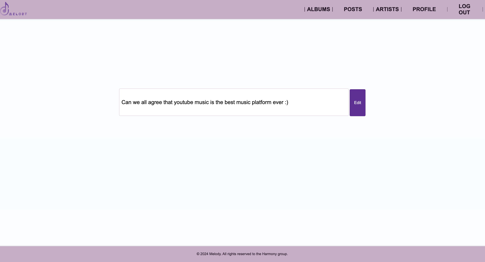
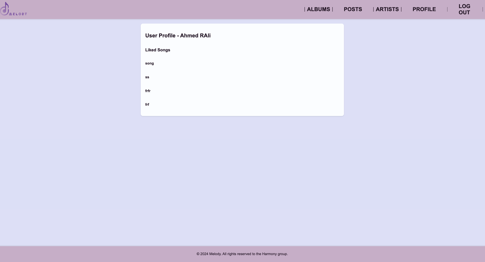

# Music App
## Date: 8/2/2024
### By: Ahmed RAli | Zahraa Ali | Zainab Ahmed

***

### ***Description***
#### A web platform is designed to enable users to peruse albums, access detailed information about them, and explore songs within each album. Users are afforded the capability to share reviews for the albums and view all of the artist's albums. Additionally, the platform incorporates a dedicated feed page where users can contribute content related to music, engage in discussions, and respond to posts. 

#### The application is designed with two distinct user roles: 
* ***Admin:***
   - **Functionality:** Admins possess exclusive rights to add, edit, and delete albums and artists.
   - **Album Management:** Complete control over album details, including the addition and removal of songs.
   - **Artist Management:** Authority to edit or remove artist information.

* ***User:***
   - **Functionality:** Users have a more focused set of capabilities, emphasizing interaction with content.
   - **Viewing Details:** Users can explore detailed information about albums and artists.
   - **Post Management:** Users are empowered to add, edit, and delete posts related to the content.
   - **Review Addition:** Ability to contribute reviews, enriching the community engagement.

*** 

### ***Technologies Used***
* EJS
  * A templating engine for JavaScript that enables dynamic content rendering on the server side, simplifying the creation of HTML templates. EJS was used for the Views
* CSS
  * Stylesheet language used to control the presentation and layout of HTML documents, enhancing the visual appeal and user experience of web pages.
* JavaScript
  * A versatile scripting language that adds interactivity to web pages. Executed on the client side, it enhances user interfaces and enables dynamic content.
* Express
  * A fast and minimalist Node.js web application framework that simplifies server-side development, facilitating the creation of robust and scalable web applications.
* Mongoose
  * An Object-Document Mapper for MongoDB and Node.js, providing a straightforward way to model and interact with MongoDB 

***

### ***Getting Started***

##### A Trello board was used to keep track of development progress and can be viewed [here](https://trello.com/b/xBSQjTRQ/music).
##### The project was deployed and can be viewed [here](https://melody.fly.dev/albums).

***

### ***Screenshots***
##### ERD 

##### Wireframes

##### App Screenshots

  <pre>
    &nbsp;&nbsp;&nbsp;&nbsp;&nbsp;&nbsp;&nbsp;&nbsp;&nbsp;&nbsp;&nbsp;&nbsp;&nbsp;&nbsp;&nbsp;&nbsp;&nbsp;&nbsp;&nbsp;&nbsp;&nbsp;&nbsp;&nbsp;&nbsp;
  </pre>

***
### ***What Have I learned***
Through the development of this project using technologies like EJS, CSS, JavaScript, Express, and Mongoose, We have gained a deep understanding of creating dynamic web applications. The functionality implemented, such as user-specific roles granting unique privileges, admin controls for album and artist management, and user capabilities for posts and reviews, showcases our proficiency in designing a feature-rich platform. This experience has honed our skills in combining frontend and backend technologies to deliver an engaging and functional website. 
Collaborating with a cohesive team has been integral to the success of this project. The collective understanding of project objectives and seamless communication among team members ensured a harmonious development process. Everyone contributed to defining and implementing the required functionalities, resulting in a shared sense of accomplishment. The positive atmosphere throughout the development cycle reflects not only technical proficiency but also effective teamwork, highlighting the importance of collaboration in delivering a satisfying and well-executed web platform.

***
### ***Future Updates***
- [ ] Search functionality 
- [ ] Albums/Artists categorized by genre
- [ ] Removing the liked songs from the profile page
- [ ] Being able to play the songs through the website

***

### ***Credits***

[SEI-08 Lessons and Labs of Unit 2](https://github.com/SEI-08-Bahrain/class_wiki?tab=readme-ov-file) |
[Input Styling](https://uiverse.io/inputs) |
[Flexboxes and Grids Styling](https://css-tricks.com/snippets/css/a-guide-to-flexbox/)

***
